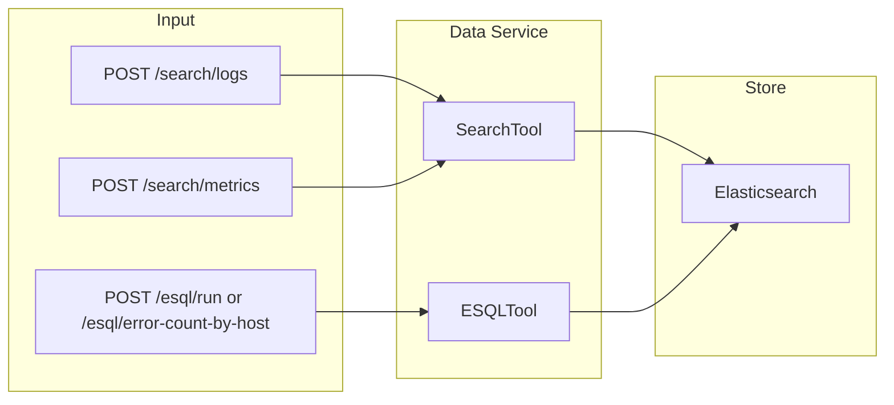
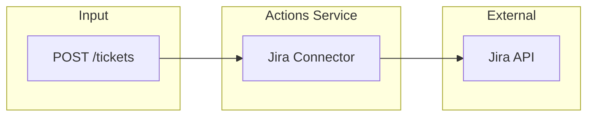
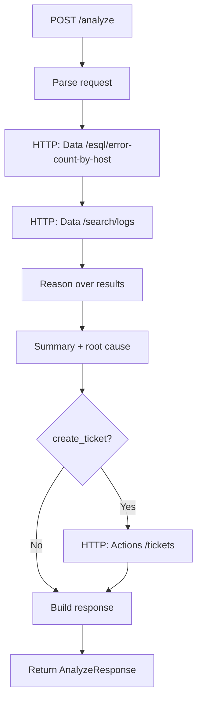

# IROA Architecture and Agent Flow

**IROA** — Incident Response + Observability Agent. Search. Reason. Resolve.


## Elastic Agent Builder & Elasticsearch usage

IROA is built to align with **Elastic Agent Builder** and **Elasticsearch** as required by the hackathon:

- **Elasticsearch as system of record:** All retrieval and correlation use **Elasticsearch** only. No external search or analytics store.
- **Elasticsearch Search API:** Used in every analyze run for full-text search over `logs-*` with time bounds and query relevance. Implemented in `iroa/tools/search.py` (SearchTool).
- **ES|QL:** Used for aggregations (e.g. error count by host, time-bucketed) over `logs-*` and `metrics-*`. Implemented in `iroa/tools/esql.py` (ESQLTool).
- **Agent Builder pattern:** A single **agent** orchestrates the flow: it receives a query or alert, calls **Search** and **ES|QL** as tools, correlates results, produces a hypothesis, optionally creates a ticket (Jira), and returns a structured response with evidence and audit trail. The core loop is in `iroa/agent/runner.py` (`run_agent`). This matches the Agent Builder idea of an agent that uses Elasticsearch-backed tools and explains its actions.
- **Observability data:** Logs and metrics live in Elasticsearch indices (`logs-*`, `metrics-*`); the agent reasons over time ranges and returns **citations** (evidence) to Elasticsearch documents.

The diagrams below show the system architecture (microservices or monolith), the **8-step agent loop**, and how the Data service exposes Search and ES|QL.


## 1. System Architecture (Microservices)

```mermaid
flowchart TB
  subgraph clients [Clients]
    User[User / API Consumer]
    CLI[CLI]
  end

  subgraph agent_svc [Agent Service :8000]
    Orchestrator[Orchestrator]
  end

  subgraph data_svc [Data Service :8001]
    Search[Search API]
    ESQL[ES|QL API]
  end

  subgraph actions_svc [Actions Service :8002]
    Tickets[Create Ticket API]
  end

  subgraph external [External Systems]
    ES[Elasticsearch]
    Jira[Jira]
  end

  User --> Orchestrator
  CLI --> Orchestrator
  Orchestrator --> Search
  Orchestrator --> ESQL
  Orchestrator --> Tickets
  Search --> ES
  ESQL --> ES
  Tickets --> Jira
```

- **Agent Service (port 8000):** Single entry point. Receives `POST /analyze`, calls Data and Actions services, runs correlation and reasoning, returns `AnalyzeResponse`.
- **Data Service (port 8001):** Search + ES|QL over Elasticsearch only. No direct dependency on Jira or other ticketing.
- **Actions Service (port 8002):** Create/update tickets (e.g. Jira). No Elasticsearch dependency.
- **Elasticsearch** is the system of record for observability data.


## 2. Overall Agent Flow (Core Agent Loop)

This is the 8-step loop that distinguishes IROA from a simple “chatbot over logs”.

```mermaid
flowchart TD
  A[1. Alert received] --> B[2. Run ES|QL queries]
  B --> C[3. Semantic / hybrid search]
  C --> D[4. Correlate time-series anomalies]
  D --> E[5. Generate hypothesis]
  E --> F[6. Create or update ticket]
  F --> G[7. Write audit trail]
  G --> H[8. Return explanation]
```

| Step | Description |
|------|-------------|
| 1 | Trigger: user query or ingested alert (and optional time range). |
| 2 | Data service: ES|QL (e.g. error count by host) over Elasticsearch. |
| 3 | Data service: Search over log indices (full-text / filters). |
| 4 | Agent: Correlate ES|QL and Search results (time windows, hosts, services). |
| 5 | Agent: Produce summary and root-cause hypothesis with confidence. |
| 6 | Optional: Actions service creates ticket (e.g. Jira) with summary and link. |
| 7 | Agent: Append audit trail (what was queried, decided, done). |
| 8 | Agent: Return structured response (summary, root cause, evidence, actions, explanation). |


## 3. Data Service (Sub-Agent) Flow

The Data service exposes Search and ES|QL. It has no reasoning; it only executes queries against Elasticsearch.



- **Search:** Time-bounded search over log/metric indices; optional full-text, service, log level.
- **ES|QL:** Run raw ES|QL or predefined “error count by host” (and similar) queries.
- All data comes from Elasticsearch (system of record).


## 4. Actions Service (Sub-Agent) Flow

The Actions service performs side effects only: create (or update) tickets.



- **Input:** Title, description, severity, target system (e.g. `jira`).
- **Output:** Action record (system, identifier, link) for audit and response.


## 5. Agent Service (Orchestrator) Flow

The Agent service implements the Core Agent Loop by calling Data and Actions over HTTP.



- **Orchestrator** does not connect to Elasticsearch or Jira directly; it only calls Data and Actions services and then runs the in-memory reasoning (correlation + hypothesis) and builds the final response.


## 6. Monolith vs Microservices

| Mode | Entry point | Data | Actions |
|------|-------------|------|--------|
| **Monolith** | `iroa.api.main:app` (single process) | In-process SearchTool + ESQLTool | In-process JiraConnector |
| **Microservices** | `services.agent.main:app` (Agent :8000) | Data service :8001 | Actions service :8002 |

The Core Agent Loop is the same; only the way Data and Actions are invoked (in-process vs HTTP) differs.
